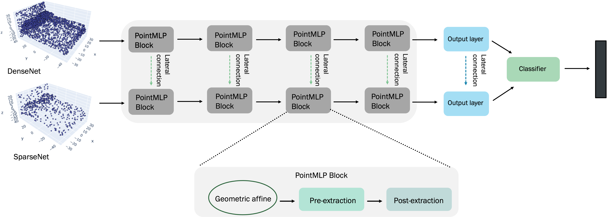

# DualNet


Primary contact: [Sneha Paul](mailto:sneha.paul@mail.concordia.ca)

<div align="center">
  
</div>


## Install

```bash
# step 1. clone this repo
git clone https://github.com/snehaputul/DualNet
cd DualNet

# step 2. create a conda virtual environment and activate it
conda env create
conda activate dualnet
```


## Useage

### Classification ModelNet40
```bash
cd classification_ModelNet40

# train pointMLP
python main.py [arguments]
```
By default, it will create a folder named "checkpoints/{modelName}-{msg}-{randomseed}", which includes args.txt, best_checkpoint.pth, last_checkpoint.pth, log.txt, out.txt.


### Classification ScanObjectNN
```bash
cd classification_ScanObjectNN
# train pointMLP

python main.py [arguments]
```

By default, it will create a fold named "checkpoints/{modelName}-{msg}-{randomseed}", which includes args.txt, best_checkpoint.pth, last_checkpoint.pth, log.txt, out.txt.


## Important parameters

```yaml
dual_net: True  # enable dual net model
num_points_low: 256  # number of points as input to the SparseNet
num_points_high: 2048  # number of points as input to the DenseNet
num_channel: 16  # number of channels in the DenseNet, channel for the SparseNet is fixed
neighbours_low: 12  # number of neighbours for the SparseNet
neighbours_high: 24  # number of neighbours for the DenseNet
```

## Scripts for reproducing the results in the paper

```bash
# For PointMLP
python main.py --last_layer_concat add --msg dual_add_512-1024 --num_points_low 512 --num_points_high 1024 --neighbours_high 32 --neighbours_low 32 --num_channel 16 --model pointMLP --workers 16 --dual_net True  --seed 0

# For ScanObjectNN
python main.py --last_layer_concat multiply --msg dual_multiply_128-2048 --num_points_low 128 --num_points_high 2048 --neighbours_high 32 --neighbours_low 16 --num_channel 16 --model pointMLP --workers 16 --dual_net True  --seed 0
```


## Results

|   Dataset    | Previous Best | Our Best |
|:------------:|:-------------:|:--------:|
|  ModelNet40  |     92.9%     |  93.7%   |
| ScanObjectNN |     85.9%     |  86.4%   |


## Acknowledgment

Our implementation is mainly based on the following codebases. We gratefully thank the authors for their wonderful works.

[PointMLP](https://github.com/ma-xu/pointMLP-pytorch),
[CurveNet](https://github.com/tiangexiang/CurveNet),
[PAConv](https://github.com/CVMI-Lab/PAConv),
[GDANet](https://github.com/mutianxu/GDANet),
[Pointnet2_PyTorch](https://github.com/erikwijmans/Pointnet2_PyTorch)


